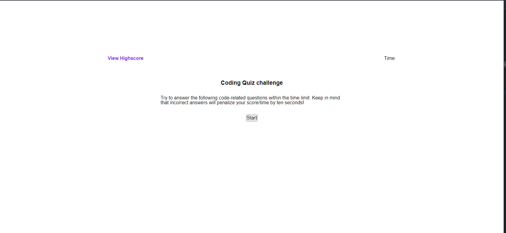
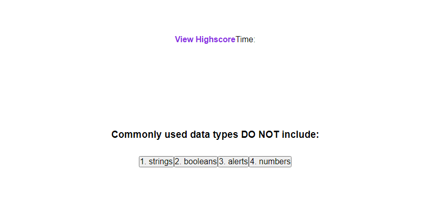

# Steven DePauw Portfolio

## Description

The purpose of this poject was to build a website that provides a simple javascript quiz to practice basic fundamental javascript skills. For example this site will have the storing of information in local storage, changing classes via JavaScript to make things appear or reappear as need and choices and questions that change on the click of a button.

## Mock-Up

The following images show the web application's appearance and functionality:

## Installation

N/A

## Usage
This practice test can be used to give a quick quiz of some basic JavaScript Knowledge and was a showcase of displaying some javascript skills

## Credits

N/A

## License

Please refer to the LICENSE in the repo.